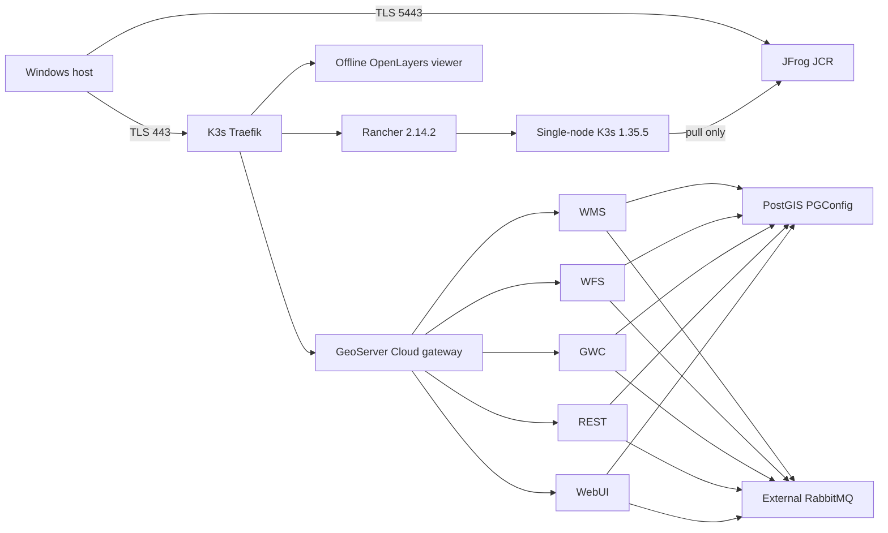

# Architecture

## Runtime topology

The simulation uses two external Docker networks:

- `gscloud-bootstrap`: ordinary bridge network used only while preparing artifacts online.
- `gscloud-runtime`: Docker `--internal` network containing JCR and the k3d/K3s containers.

JCR, its dedicated PostgreSQL metadata database, and its TLS proxy are attached to both networks during preparation. Entering air-gap mode disconnects the JCR containers from the bootstrap network and restarts the proxy so it resolves Artifactory on the internal network. The k3d containers remain on their bridge networks to preserve load-balancer routing; public egress is blocked by an OUTPUT firewall chain on the K3s node and an egress NetworkPolicy in every namespace. The K3s container runtime is configured with JCR credentials, the development CA, registry mirrors, and `--disable-default-registry-endpoint` so registry fallback cannot bypass JCR.

## Artifact model

Images are mirrored into `docker-local`. Docker Hub image paths retain their normal repository path; images from other registries are prefixed by their source registry to avoid collisions. Helm charts are packaged with dependencies and pushed to the separate `helm-local` OCI repository so Rancher can treat it as a charts-only OCI endpoint.

## Persistence

- JCR data is stored under `.state/jcr` on the host.
- PostGIS, RabbitMQ, and GeoWebCache use K3s local-path PVCs.
- `Teardown.ps1` preserves state by default. `-PurgeData` removes generated state and persistent data.
