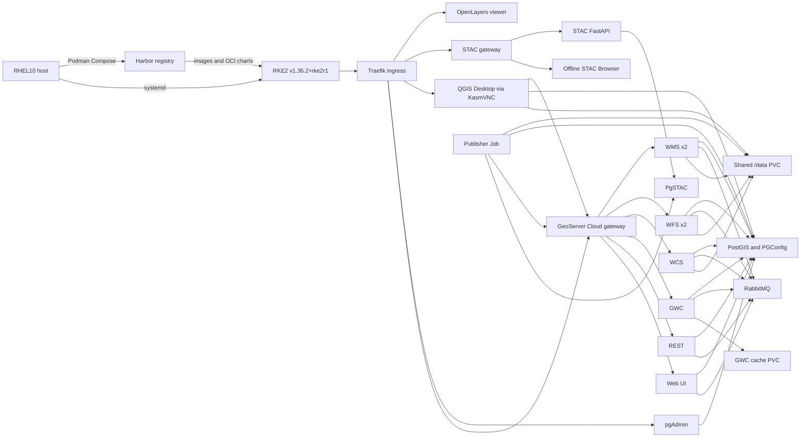

# Architecture

## Runtime Topology

The stack runs on RHEL10 with two execution layers:

- Host layer: rootful Podman Compose runs Harbor.
- Kubernetes layer: native RKE2 runs the application workloads as pods.

Harbor is started before deployment and is the only image and OCI chart source used by RKE2 workloads. RKE2 containerd is configured with Harbor credentials, the development CA, registry mirrors, and `disable-default-registry-endpoint: true` so it does not fall back to public registries.

RKE2 provides Traefik as the ingress controller in this installation. The charts use `ingressClassName: traefik`, TLS Secrets generated by `initialize-state.sh`, and Harbor-pulled images.

```mermaid
flowchart LR
  Host["RHEL10 host"] -->|Podman Compose| Harbor["Harbor registry"]
  Host -->|systemd| RKE2["RKE2 v1.36.2+rke2r1"]
  RKE2 --> Traefik["Traefik ingress"]
  Traefik --> Viewer["OpenLayers viewer"]
  Traefik --> StacGateway["STAC gateway"]
  Traefik --> QGIS["QGIS Desktop via KasmVNC"]
  Traefik --> PgAdmin["pgAdmin"]
  Traefik --> GSCGateway["GeoServer Cloud gateway"]

  Harbor -->|images and OCI charts| RKE2
  GSCGateway --> WMS["WMS x2"]
  GSCGateway --> WFS["WFS x2"]
  GSCGateway --> WCS["WCS"]
  GSCGateway --> GWC["GWC"]
  GSCGateway --> REST["REST"]
  GSCGateway --> WebUI["Web UI"]

  WMS --> PostGIS["PostGIS and PGConfig"]
  WFS --> PostGIS
  WCS --> PostGIS
  GWC --> PostGIS
  REST --> PostGIS
  WebUI --> PostGIS
  WMS --> RabbitMQ["RabbitMQ"]
  WFS --> RabbitMQ
  WCS --> RabbitMQ
  GWC --> RabbitMQ
  REST --> RabbitMQ
  WebUI --> RabbitMQ

  StacGateway --> StacApi["STAC FastAPI"]
  StacGateway --> StacBrowser["Offline STAC Browser"]
  StacApi --> PgSTAC["PgSTAC"]

  QGIS --> GSCGateway
  QGIS --> PostGIS
  PgAdmin --> PostGIS

  Publisher["Publisher Job"] --> Data["Shared /data PVC"]
  Publisher --> PostGIS
  Publisher --> GSCGateway
  Publisher --> PgSTAC
  WMS --> Data
  WFS --> Data
  WCS --> Data
  GWC --> Cache["GWC cache PVC"]
  QGIS --> Data
```

Rancher is not part of the required runtime path. If installed, it runs in `cattle-system` and can register the Harbor OCI chart repositories through Rancher Apps. If the Rancher catalog CRD is not present, `register-rancher-catalog.sh` exits cleanly and the Helm releases remain managed directly by `deploy.sh`.

## Namespaces And Workloads

`platform-infra` contains infrastructure services:

- PostGIS for PGConfig and data databases.
- RabbitMQ for GeoServer Cloud events.
- PgSTAC and its init job.
- pgAdmin and its persistent user data.
- NetworkPolicies that allow application access while protecting admin surfaces.

`gscloud` contains application services:

- GeoServer Cloud gateway, web UI, REST, WMS, WFS, WCS, and GWC.
- WMS and WFS run with two replicas each.
- Viewer, STAC API, STAC Browser, STAC gateway, QGIS, and publisher/bootstrap jobs.
- Shared geodata PVC and GWC cache PVC.

`kube-system` contains RKE2 system components, including Traefik ingress.

## Artifact Model

Images are mirrored into the Harbor `airgap` project. Docker Hub images keep their normal repository path; images from other registries are prefixed with the source registry path to avoid collisions. For example, `ghcr.io/stac-utils/pgstac:v0.9.11` is mirrored below `airgap/ghcr.io/stac-utils/pgstac:v0.9.11`.

Helm charts are packaged and pushed to the Harbor `charts` OCI project:

- `charts/platform-infra:0.3.0`
- `charts/geoserver-cloud-sim:0.3.0`

The Rancher chart is downloaded and stored locally in `.state/` for optional Rancher installation; it is not required for the app deployment.

## Air-Gap Controls

Air-gap behavior has three layers:

- RKE2 registry configuration rewrites public registry pulls to Harbor and disables default public fallback.
- `harbor-credentials` image pull Secrets are created in the application namespaces.
- `enter-airgap.sh` applies egress NetworkPolicies to block pod access outside private network ranges.

`enter-airgap.sh --strict-host-egress` can add a host OUTPUT firewall chain, but that mode is opt-in because RKE2 and Harbor run directly on the RHEL host.

## Persistence

- Harbor state is stored under `.state/harbor` on the host.
- Static local PersistentVolumes are prepared under `/var/lib/rancher/rke2/local-storage/geoserver-cloud-rancher`.
- PostGIS, PgSTAC, RabbitMQ, pgAdmin, QGIS profile, shared geodata, and GWC cache each have persistent storage.
- QGIS and GeoServer Cloud share the `/data` PVC for file-based geodata exchange.
- GeoServer catalog configuration is stored in PGConfig, not in a shared GeoServer data directory.

Because this is a single-node simulation, `ReadWriteOnce` local storage is sufficient. A multi-node deployment should replace the static local PersistentVolumes with a storage class that supports the required access modes, especially for shared geodata.
